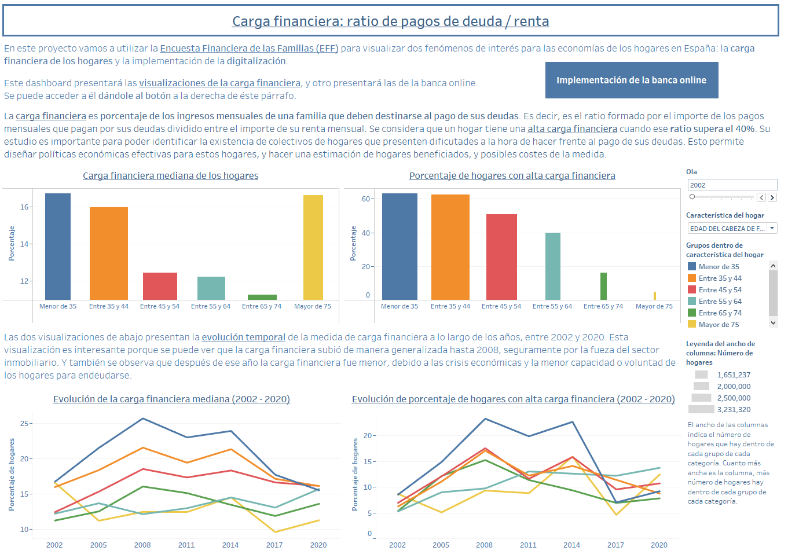

# VIZ_UOC_PRA2
Repositorio creado para el proyecto de la PRA2 del Máster Universitario en Ciencia de Datos de la UOC

# Descripción del proyecto:
Este proyecto realiza unas visualizaciones de datos sobre los temas de la carga financiera de los hogares y la implementación de los servicios de banca online entre los hogares españoles entre 2002 y 2020. Para ello, se han utilizado los datos de la Encuesta Financiera de las Familias desde su ola de 2002 hasta la de 2020.

# Fases:
El proyecto se divide en dos fases:
1) **Descarga, carga y transformación de los datos:**
   - Descarga de datos: Puede hacerse gratuitamente en el [**sitio web EFF**](https://app.bde.es/efs_www/home?lang=ES). Más concretamente:
        - [Pestaña descarga](https://app.bde.es/efs_www/download?lang=ES): Contiene series con los resultados principales de todas las olas. Se pueden descargar todas las series, o una selección.
        - [Pestaña microdatos](https://app.bde.es/gnt_seg/controlAccesoEmail.jsp?pas=eff&lang=es&p1=2020&lang=es): Desde aquí pueden descargarse los microdatos de la encuesta. Se requiere un registro al sistema, pero es gratuito y su principal objetivo es ser incluido en una lista de distribución para recibir notificaciones sobre publicación de nuevas ediciones o versiones de los datos.
   - Carga y transformaciones sobre los datos: Se utilizan técnicas ETL en código Python para transformar los datos a un formato utilizable para su visualización.
2) **Visualizaciones**:
   - Las visualizaciones se han realizado con la herramienta Tableau, y están publicadas en Tableau Public. Pueden verse a travñes de [este enlace](https://public.tableau.com/views/EFF_cargafinanciera_bancaonline/Fragilidadfinancieraratiopagosdeudarenta?:language=en-US&:display_count=n&:origin=viz_share_link).
  

  
 

# Contenidos de este repositorio
Este repositorio contiene 

